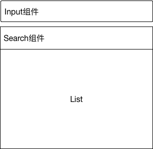

## 书写一个React高质量组件

### 首先上预期图


- 从图片中不难发现，整个组件可以拆分成 两个`Input`组件和一个展示的`List`;

#### SelectInput 

主要是接受props，显示选中的值，我们可以用选择写一个*Stateless*组件

```jsx
const SelectInput = props =>{
	return (
		<div className='select-input' onClick={props.onClick}>
			<Input placeholder={props.placeholder} readOnly={props.readOnly} disabled={props.disabled} onChange={props.onSearch} value={props.value}/>
		</div>
	)
}
```

#### SearchInput 

主要是搜索，然后将*keyword*传递出去，筛选List，但是他本质还是一个`Input`,所以可以写一个 HOC (高阶组价)，来达到效果

```jsx

const getSearchBox = WrappedComponent =>{
	class SearchBox extends React.Component {
		constructor(props) {
			super(props);
			this.state = {
				keyword:''
			};
			this.handleSearch = this.handleSearch.bind(this);
		}
		
		render() {
			const { keyword } = this.state;
			return (
				<div className='search-input' ref={(ele)=>{this.searchInputDOM=ele}}>
					<WrappedComponent {...this.props} value={keyword} onSearch={this.handleSearch}/>
					<i className="icon-search"></i>
				</div>
			);
		}
	}
	return SearchBox
}

```

#### List

接下来是List展示结果列表,根据 *keyword*来过滤展示结果,也可以写出`Stateless`组件

```jsx
const List = props =>{
	// 过滤操作
	// ...
	return (
		<ul>
			{options.map((item,i)=>{
				return <li key={i} onClick={()=>{props.clickItem(item)}}>{item.label}</li>
			})}
		</ul>
	)
}
```

#### 最后合并组件，知道以上三个组件联系，将他们组合起来

```jsx
export default class Select2 extends React.Component {
	constructor(props){
		super(props);
		this.state = {
			opened:false, // 展开/收起 菜单
			keyword:''
		};

		this.handleClick = this.handleClick.bind(this);
		this.handleSearch = this.handleSearch.bind(this);
		this.handleSelect = this.handleSelect.bind(this);
	}

	componentDidMount() {
		// 关闭弹框
	}

	// 获取SelectInput的value
	getValue(){

	}


	static defaultProps = {
		disabled:false,
		searchable: false,
		placeholder:'请选择',
		searchPlaceholder:'请搜索',
		noResultsText:'没有结果',
		SearchInput:getSearchBox(SelectInput),
	}

	// 单击 selectInput 展开下拉
	handleClick(){
		
	}

	// 获取搜索框的keyord 
	handleSearch(keyword){
		
	}
	
	// 选择下拉项
	handleSelect(item){

	}

	render(){
		const { placeholder,SearchInput,searchPlaceholder,disabled,searchable,options,noResultsText,value } = this.props;
		const selectInputValue = this.getValue(value);
		const { opened,keyword } = this.state;
		const selectClassName = classnames({
			['select2']:true,
			['opened']:opened,
			['searchable']:searchable
		});
		return (
			<div className={selectClassName} ref='select'>
				<SelectInput onClick={this.handleClick} readOnly placeholder={placeholder} value={selectInputValue} disabled={disabled} />
				<div className='menu' key={1} data-show={opened} style={{display:opened ? 'block' : 'none'}}>
					{searchable ? <SearchInput ref='searchInut' placeholder={searchPlaceholder} onSearch={this.handleSearch}/> : null}
					<List keyword={keyword} noResultsText={noResultsText} options={options} clickItem={this.handleSelect}/>
				</div>
			</div>
		)
	}
}
```

至此，组件书写完毕，如果还有小伙伴不明白可以参考[源码]()